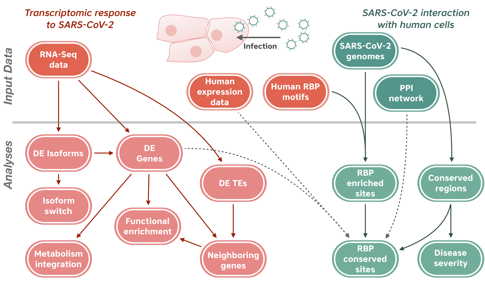

# Genome-wide bioinformatic analyses predict key host and viral factors in SARS-CoV-2 pathogenesis

## Introduction

The novel betacoronavirus named Severe Acute Respiratory Syndrome Coronavirus 2 (SARS-CoV-2) caused a worldwide pandemic (COVID-19) after initially emerging in Wuhan, China. To better understand how SARS-CoV-2 interacts with human cells, we devised a novel, comprehensive bioinformatic strategy to analyze public RNA sequencing and viral genome sequencing data, which included:
1. Detection of differentially expressed human genes along with functional and signaling pathway enrichment analyses.
2. Analysis of changes in transcript isoform expression and usage
3. Identification of transposable elements (TEs) deregulated during infection.
4. Prediction of conserved interactions between viral RNA and human RNA-binding proteins (RBPs).
5. Prediction of viral sequence variants potentially affecting host response.

<figure>
  

  
  

</figure>

To our knowledge, this is the *first meta-analysis to predict host factors that play a specific role in SARS-CoV-2 pathogenesis, distinct from other respiratory viruses*. 

## Main findings

* We developed a novel bioinformatic pipeline to explore how SARS-CoV-2 interacts with human respiratory cells using public available host gene expression and viral genome sequence data. 

* Several human genes and proteins were predicted to play a role in the viral life cycle and the host response to SARS-CoV-2 infection. For instance, well-known immunoregulatory genes including _CSF2_, _IL32_ and _SERPINA3_ were specifically differentially expressed in SARS-CoV-2 datasets. SERPINA3, an essential enzyme in the regulation of leukocyte proteases, is induced by cytokines, and has been proposed to inhibit viral replication ([PMID:27403523](https://pubmed.ncbi.nlm.nih.gov/27403523/)). This was the only gene consistently upregulated in all cell line samples infected with SARS-CoV-2 and absent from the other virus-infected datasets in this study. 

* On top of a general upregulation of the gene itself, we detected a significant shift in isoform usage of interleukin 6 (_IL-6_) in SARS-CoV-2 infected samples. A shift in 5’ UTR usage in the presence of SARS-CoV-2 may be attributed to indirect host cell signaling cascades, triggering changes in transcription and splicing activity, which could also explain the overall increase in _IL-6_ expression. Interestingly, Tocilizumab, a known inhibitor of _IL-6_ has been recently described as the second drug able to reduce mortality of COVID-19 ([PMID:33933206](https://pubmed.ncbi.nlm.nih.gov/33933206/)).

* We detected upregulation of several immunoregulatory TE families in SARS-CoV-2 infected cells. The MER41B family, for instance, is known to contribute to interferon gamma inducible binding sites (bound by STAT1 and/or IRF1). Functional enrichment of nearby genes was in accordance with these findings, since several immunity related terms were enriched along with "progressive pulmonary impairment". In parallel, TEs seem to be co-regulated with phospholipid metabolism, which directly affects the Pi3K/AKT signaling pathway, central to the immune response. Alterations in phospholipid metabolism and the PI3K/AKT pathway were detected in our metabolic flux analysis and functional enrichment analysis respectively. Glycerophospholipids and fatty acids were reported to be significantly dysregulated in COVID-19 patients ([PMID:32610096](https://pubmed.ncbi.nlm.nih.gov/32610096/)). Finally, alteration of fatty acid metabolites in COVID-19 patients was highly correlated with IL-6 levels ([PMID:32559180](https://pubmed.ncbi.nlm.nih.gov/32559180/)), showing the potential of genome-wide complementary approaches to better understand this complex disease.

* RBPs are likely candidates for host factors involved in the response of human cells to SARS-CoV-2 as well as viral manipulation of host machinery. We predicted conserved interactions between the SARS-CoV-2 genome and human RNA-binding proteins such as the eukaryotic initiation factor 4 (eIF4b), suggesting that SARS-CoV-2 viral protein translation could be eIF4b-dependent. We also detected upregulation of the _EIF4B_ gene in SARS-CoV-2 infected cells, which might indicate that this protein is sequestered by the virus and therefore cells need to increase its production. Another conserved RBP and also upregulated in infected cells, is the Poly(A) Binding Protein Cytoplasmic 1 (PABPC1), which is involved in mRNA stability and translation. Interestingly, PABPC1 and PABPC4 have been reported to interact with the SARS-CoV-2 N protein, which stabilizes the viral genome ([PMID:32353859](https://pubmed.ncbi.nlm.nih.gov/32353859/)). Binding motifs for hnRNPA1 were enriched specifically in the 3’UTR of SARS-CoV-2 even though they were depleted in the genome overall. hnRNPA1 interacts with 3’UTRs of other coronaviruses, and participates in transcription and replication of the Murine Hepatitis Virus ([PMID:11333880](https://pubmed.ncbi.nlm.nih.gov/11333880/)). The hnRNPA1 gene, along with hnRNPA2B1, was downregulated in infected cells and in contrast to the previous examples of upregulated genes, could denote a response from human cells to control viral replication.

* We also identified a viral sequence variant with a statistically significant skew associated with age of infection, that may contribute to intracellular host-pathogen interactions. The P323L mutation in the RNA-dependent RNA polymerase (RdRP) was previously shown to be associated with changes in geographical location of the viral strain ([PMID:32321524](https://pubmed.ncbi.nlm.nih.gov/32321524/)), though not with the age of the patient. 

* These findings can help identify host mechanisms that can be targeted by prophylactics and/or therapeutics to reduce the severity of COVID-19. In conclusion, we envision that applying this workflow will yield important mechanistic insights in future analyses on emerging pathogens, and we provide all source code freely for future use. Similarly, we expect that these findings will give rise to future studies that elucidate the underlying mechanism(s) responsible for such host-pathogen interactions. Modulating the host components of these mechanisms can aid in the selection of host-based drug targets, prophylactics, and/or therapeutics to reduce virus infection and replication with minimal adverse effects in humans. 

## Contents

This GitHub repository contains the code to reproduce the analyses included in our publication, [Genome-wide bioinformatic analyses predict key host and viral factors in SARS-CoV-2 pathogenesis](https://www.nature.com/articles/s42003-021-02095-0).

Each of the following sections contains instructions and code to replicate our analyses into specific aspects of SARS-CoV-2 host-virus interactions.

### [RNA-Seq Data Processing](https://github.com/vaguiarpulido/covid19-research/tree/master/scripts/data_processing)
Instructions and code to process RNA-seq datasets from virus-infected and control samples, including read alignment and transcript quantification.

### [Exploratory Analyses of RNA-Seq Data](https://github.com/vaguiarpulido/covid19-research/tree/master/scripts/downstream_analyses)
Instructions and code to perform PCA analysis, differential expression analysis, and GO term enrichment based on RNA-seq data.

### [Pathway Analysis](https://github.com/vaguiarpulido/covid19-research/tree/master/scripts/pathways)
Instructions and code to identify statistically significant alterations in pathway expression based on the differentially expressed genes detected by DESeq2.

### [Metabolic Projection](https://github.com/vaguiarpulido/covid19-research/tree/master/scripts/Metabolic-fluxes)
Instructions and code to project gene expression data onto the human metabolic network, and predict increased or decreased metabolic fluxes.

### [Isoform Usage Analysis](https://github.com/vaguiarpulido/covid19-research/tree/master/scripts/isoform_analysis)
Instructions and code to analyze isoform usage and predict functional consequences of isoform-level changes in virus-infected samples.

### [Transposable Element Analysis](https://github.com/vaguiarpulido/covid19-research/tree/master/scripts/TE-analysis)
Instructions and code to analyze transposable element activity in virus-infected samples.

### [RBP analysis](https://github.com/vaguiarpulido/covid19-research/tree/master/scripts/rbp)
Instructions and code to predict putative binding sites for human RBPs on viral genome sequences, and to analyze binding site conservation across multiple SARS-CoV-2 isolates.

### Viral variant-phenotype association
For this analysis, we used the mega-CATS algorithm as described [here](https://github.com/bpickett/megaCATS).

## Supplementary materials

Supplementary materials for this work can be downloaded at:  

## Citation

Please cite our paper as follows:

Ferrarini, M.G., Lal, A., Rebollo, R. et al. Genome-wide bioinformatic analyses predict key host and viral factors in SARS-CoV-2 pathogenesis. Commun Biol 4, 590 (2021). https://doi.org/10.1038/s42003-021-02095-0

The code in this repository can also be cited separately as:

